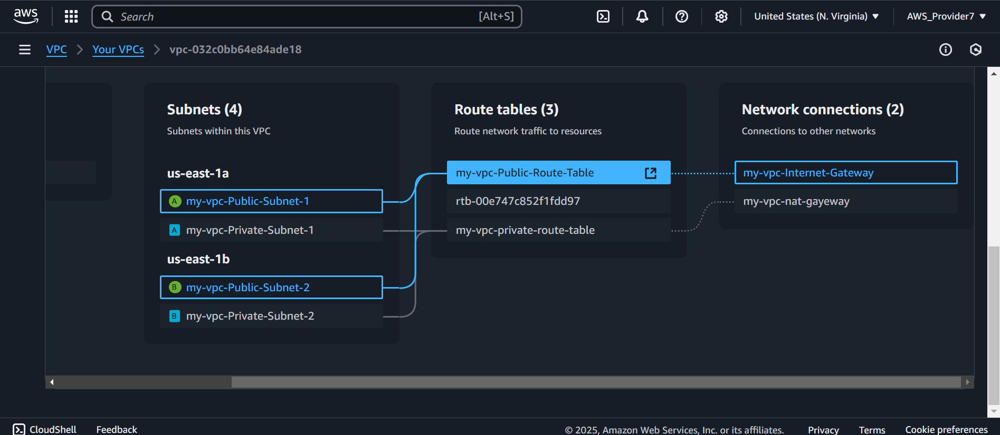
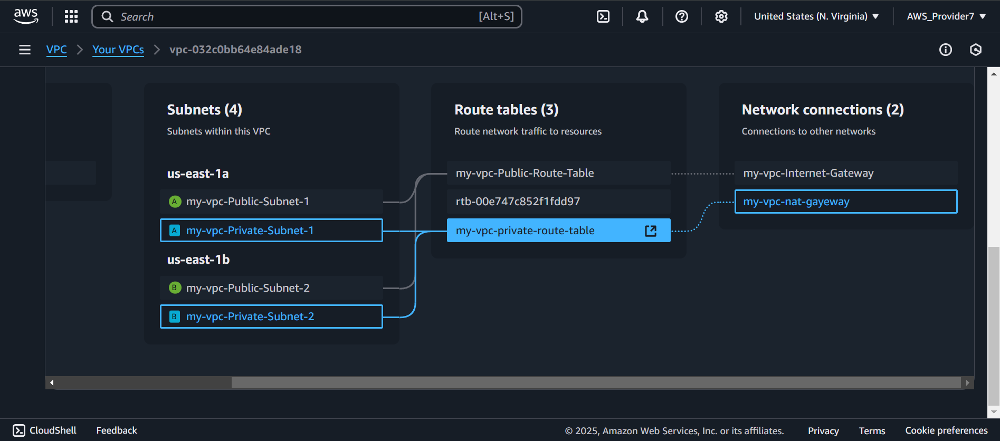
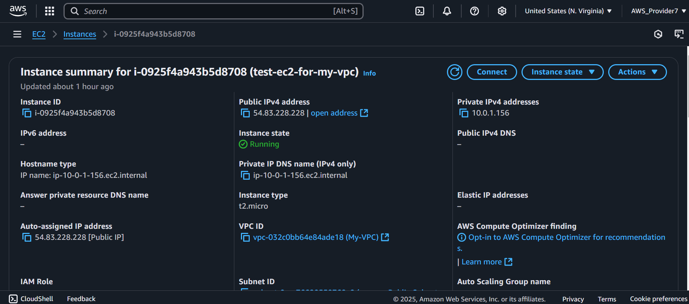
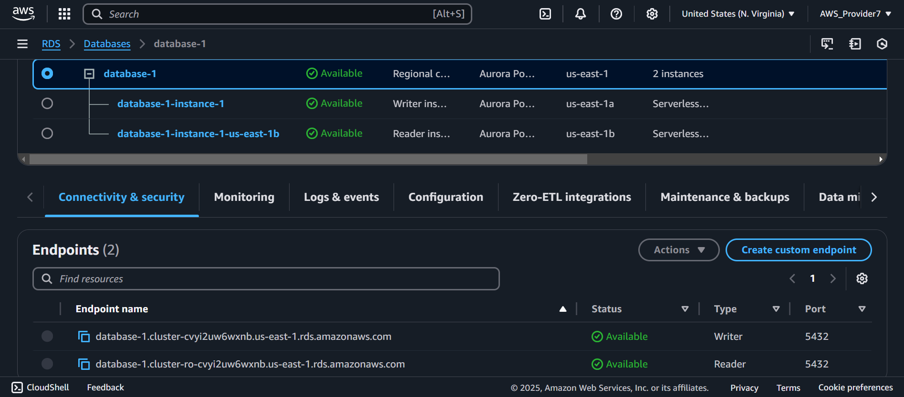
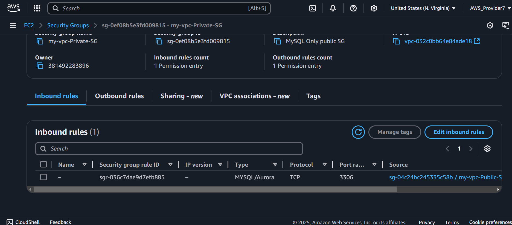
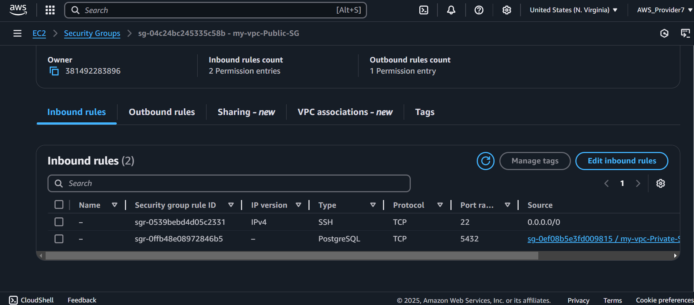
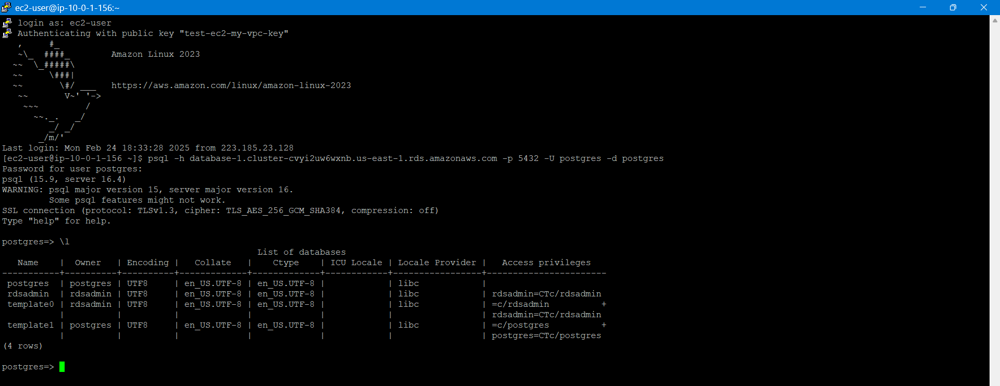

# 🏗 AWS RDS with EC2 Integration – Cloud & DevOps Project

## 📌 Project Overview  
This project demonstrates how to set up and securely connect an **Amazon RDS PostgreSQL database** with an **EC2 instance** inside a custom **VPC**. The goal is to simulate a real-world cloud environment by implementing **security best practices, networking configurations, and database connectivity**.

---

## 🛠️ Technologies Used  
- **AWS Services**: RDS, EC2, VPC, Security Groups, IAM  
- **Database**: PostgreSQL  
- **Networking**: Custom VPC, Private/Public Subnets, Security Groups  
- **Operating System**: Amazon Linux 2 (EC2 instance)  
- **Tools**: SSH, psql (PostgreSQL CLI)  

---

## 🚀 Project Steps  

### **1️⃣ Setting Up the Custom VPC & Networking**  
- Created a **custom VPC** to manage networking for the EC2 and RDS instances.  
- Configured **subnets** (public and private) and assigned proper **routing tables**.  
- Enabled **Internet Gateway** for external access to EC2.  

📸 
*Configured route table and internet gateways for public subnets* 

---

📸 
*Configured route table and NAT gateways for private subnets*  

---

### **2️⃣ Launching an EC2 Instance**  
- Created an **EC2 instance** (Amazon Linux 2) in the public subnet.  
- Configured SSH access via a **public security group** allowing port **22 (SSH)** and **80 (HTTP)**.  

📸  
*EC2 instance running in AWS Console*  

---

### **3️⃣ Creating an RDS PostgreSQL Database**  
- Launched an **Amazon RDS instance** using **PostgreSQL**.  
- Configured RDS in a **private subnet** for security.  
- Created a **security group** allowing access **only from the EC2 instance**.  

📸 
*RDS instance created and running*  

---

### **4️⃣ Configuring Security Groups for Secure Access**  
✅ **EC2 Security Group**: Added **PostgreSQL (port 5432)** inbound rule with the source as the **RDS security group**.  
✅ **RDS Security Group**: Allowed **PostgreSQL (port 5432)** inbound connections **only from the EC2 security group**.  

📸 
*Security group for RDS instance with inbound rules*  

---

📸 
*Security group for EC2 instance with inbound rules*  

---

### **5️⃣ Installing PostgreSQL Client on EC2 & Connecting to RDS**  
```sh
# Update EC2 instance
sudo dnf update -y

# Install PostgreSQL client
sudo dnf install -y postgresql

# Verify installation
psql --version
```
---

### 6️⃣ Connecting to RDS from EC2
```sh
# Connect to PostgreSQL RDS instance
psql -h <RDS_ENDPOINT> -p 5432 -U postgres -d postgres
```
🔹 Successfully logged into PostgreSQL RDS ✅

---

### 7️⃣ Verifying Database Connection
Inside the PostgreSQL prompt (psql), run:

```sh
\l  -- List all databases
SELECT version();  -- Check PostgreSQL version
```

---

📸 
*Successful connection to RDS instance from EC2 terminal and database list and PostgreSQL version*

---

## 🔐 Security Best Practices Implemented
✅ RDS in a private subnet (not publicly accessible)

✅ Security groups with least privilege access

✅ IAM roles and permissions for EC2 access

✅ Encrypted database connections (TLS enabled)

## 📚 Key Learnings & Takeaways

🚀VPC & Networking: Subnet design, security groups, routing

🚀Database Administration: PostgreSQL on AWS RDS

🚀Linux & CLI Operations: SSH, installing & configuring services

🚀Cloud Security: Private database access, IAM policies

## 📝 Next Steps & Improvements

🔹 Automate EC2 & RDS setup using Terraform or AWS CloudFormation

🔹 Deploy a web application (e.g., Flask/Django) that interacts with the database

🔹 Set up CloudWatch monitoring & automated backups for RDS

## 🏆 About Me

🚀 Aspiring DevOps & Cloud Engineer passionate about AWS, Infrastructure 
as Code, and automation. Seeking opportunities in Cloud/DevOps Engineering.

🔗 LinkedIn Profile:[https://www.linkedin.com/in/dhwarakesh-srinivasan-361719292](https://www.linkedin.com/in/dhwarakesh-srinivasan-361719292)
📧 Email: [dhwarakesh99@gmail.com](dhwarakesh99@gmail.com)
